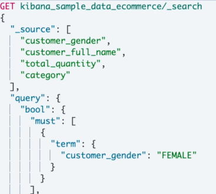
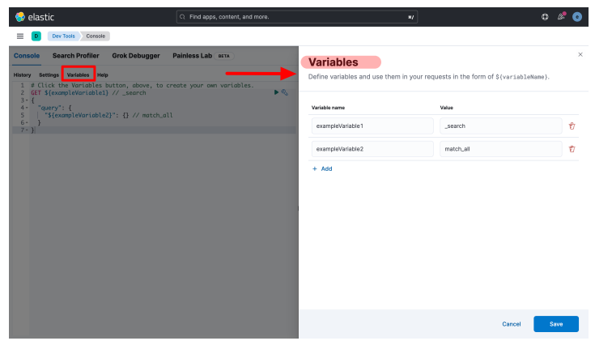
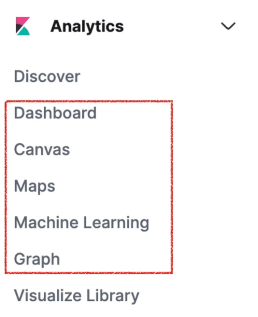

# Elasticsearch


### Elasticsearch란?
- 광범위한 개방형 검색 플랫폼
- HTTP의 json 인터페이스 지원
- 다양한 프로그래밍 언어 지원 

### Elasticsearch 용도
- 검색엔진
- 분석 및 인사이트 제공 (어떤 데이터를 적재하는지에 따라 다양한 분석이 가능)
  - 로그 분석
  - 이벤트 분석
  - 성능 분석
- 머신 러닝

**엘라스틱 스택**
- Elasticsearh의 오픈소스 프로젝트
  - 데이터 소스 수집부터 시각화까지의 end to end 스택
  - 로그 수집을 위한 logstash
  - 시각화, 분석을 위한 kibana
  - 네트워크 데이터, 시스템 지표, 성능, 로그를 위한 filebeat

### Elasticsearch 특징
- 기본적인 용도 - 검색 및 집계
- 동적 스키마(자동 생성)
- REST API 인터페이스
- 분산 적재(샤딩)
- 트랜잭션 미지원
- JOIN 미지원

### Elasticsearch 요청과 응답
- 모든 동작을 REST API로 제공
- 입력 -> PUT
- 조회 -> GET
- 삭제 -> DELETE
- 수정 -> POST

### Elasticsearch 기본 요소

**인덱스**는 elasticsearch에서 관련된 문서가 저장되는 데이터베이스의 역할을 한다. 만약 book이라는 인덱스가 있다면 책과 관련된 여러 문서를 포함할 수 있다.

<br>

**문서**는 실제 데이터를 포함하는 JSON 객체로 다음의 예시를 들 수있다.
```json
{
  "title": "엘라스틱 서치 알아보기",
  "author": "ithingv34",
  "year": 2023
}
```
만약 RDB 테이블이라면 다음과 같이 테이블 스키마를 생성할 수 있다

```mysql
CREATE TABLE books (
  id BIGINT AUTO_INCREMENT PRIMARY KEY,
  title VARCHAR(255),
  author VARCHAR(255),
  year YEAR
)
```

<br>

**매핑**은 문서 내 필드 구조와 데이터 유형을 정의한다. Elasticsearch가 데이터를 효율적으로 인덱싱하고 검색하는 방법을 이해하는 데 도움이 된다. 인덱스를 만들 때 해당 인덱스 내 문서의 필드 속성을 정의하는 매핑을 제공할 수 있다.


- 예를 들어 "book" 인덱스에 대한 매핑은 "title" 필드가 "text" 유형이고 "author" 필드가 "keyword" 유형이며 "year" 필드가 "int" 유형임을 정의할 수 있다. 이 정보는 Elasticsearch가 데이터를 올바르게 처리하고 분석하는 데 도움이 된다.


- 매핑을 사용하면 텍스트 필드에 대한 분석기 또는 날짜 필드에 대한 사용자 정의 형식과 같은 추가 설정을 정의할 수도 있다.

**RDB와 비교**

|Elasticsearch | RDB|
|:---:|:---:|
|인덱스 | 테이블|
|문서 | 행(ROW) |
|필드 | 열(COL) |
|매핑 | 스키마 |

**인덱스**
- 문서를 저장하는 논리적 단위
- 기존 RDB의 테이블과 유사
- 하나의 인덱스에는 많은 문서들이 포함됨 (모든 문서는 인덱스에 포함됨)
- 하나의 인덱스는 동일한 스키마를 가짐
- 스키마에 따라 인덱스가 달라야함

**매핑**
- 관계형 데이터베이스의 스키마와 유사
- 매핑의 종류
  - 동적 매핑 (다이나믹 매핑)
    - ES가 데이터 타입을 보고 자동으로 매핑
    - 인덱스의 규모가 커지면 성능에 영향을 받음
  - 직접 매핑
    - 인덱스 매핑을 직접하는 것
    - 인덱스 생성 시 매핑 설정
    - 매핑 API 이용

### Elasticsearch 데이터 타입

| 분류 | 타입 | 설명 |
|:---:|:----|:--|
|정수형 | integer, short, byte, long | |
|실수형 | float, double | |
|이진값 | binary | Base64 string 같이 인코딩된 바이너리|
|참/거짓 | boolean | true / false |
| 객체 | object | JSON 객체 |
| IP | ip | IP 주소값
| 텍스트 | text | 전문 검색용, 텍스트 분석기가 텍스트를 분리|
| 텍스트 | keyword | 분석용으로 사용 X, 정렬, 집계에 사용|
| 날짜 | date | 날짜나 시간값 |
| 범위 | integer_range, float_range, ong_range, double_range date_range, ip_range | 최소값과 최대값으로 범위를 설정한 데이터|


### Elasticsearch 인덱스 템플릿

- 동일한 다수의 인덱스를 만들 때 사용
- 인덱스 파티셔닝에서 동일한 인덱스를 매번 설정해야 하는 문제
- 템플릿 생성
  - 템플릿 직접 생성
  - 동적 템플릿
- 기본적인 설정
  - 매핑
  - 세팅
- 템플릿은 새 인덱스부터 적용

### 분석기


- 역 인덱싱 - 긴 텍스트를 잘게 나눠서 인덱싱하는 기술
- 분석기 = 토크나이저 + 캐릭터 필터 + 토큰 필터

- 분석기 구성
    | 분석기 구성 요소 | 설명 |
    |:---:|:----:|
    |Char Filter | 입력을 받은 원본 텍스트 문자열을 추가, 변경, 제거 |
    | Tokenizer | 문자열을 받아서 분리 기준에 따라 문자열을 토큰 분리|
    | Token Filter | 토큰을 추가하거나 수정 및 제거|

**분석기 파이프라인**


[**분석기 처리 예시**](https://www.elastic.co/kr/blog/found-text-analysis-part-1)


1. 원본 문자열
2. HTML Strip (Char Filter)
3. standard Tokenizer
4. lowercase Token Filter
5. stop Token Filter
6. snowball Token Filter

[**내장된 분석기 종류**](https://www.elastic.co/guide/en/elasticsearch/reference/current/analysis-analyzers.html)

- Standard
  - 기본적으로 사용하는 분석기, 영문법 기준
- Simple
  - 문자만 토큰화
- Whitespace
  - 공백을 기준으로 토큰화
- Stop
  - 스톱 필터 포함
- keyword

[### 토크나이저](https://www.elastic.co/guide/en/elasticsearch/reference/current/analysis-tokenizers.html)

- 분석기에 반드시 포함되는 문자열 분리 기능
- Word Oriendted Tokenizer
  - 전체 문장에서의 개별적인 단어로 분리
- Partial Word Tokenizers
  - 부분 단어 일치를 위해 텍스트, 단어를 조각냄
- Structured Text Tokenizers
    - 이메일, 주소, 경로와 같은 구조화된 텍스트 분리
   
[### 역인덱스 (Inverted Indexes and Index Terms)](https://www.elastic.co/kr/blog/found-elasticsearch-from-the-bottom-up)

- 책의 **찾아보기** 색인과 유사
- 분리된 단어를 역인덱싱해서 문서를 쉽게 찾을 수 있음
  


### Elasticsearch 검색
- 관계형 데이터베이스의 검색 조회(작은 서비스) 그 이상의 검색
- 텍스트 매칭
- 텍스트의 변형 검색
- 스코어링 알고리즘

**쿼리 사용방법**



- 쿼리스트링
  - 한 줄에 들어가는 정도
  - 간단한 쿼리에 사용
  - 길어지면 복잡하고 가독성이 떨어짐
- 쿼리 DSL
  - 한 줄을 넘어가는 복잡한 쿼리
  - 쿼리 전용언어
  - JSON 기반의 언어
  - REST API 요청 본문에 JSON 쿼리 작성

**쿼리 종류**
- 리프 쿼리
  - 특정 필드에서 용어를 검색하는 방식
  - 매치, 용어, 범위
- 복합 쿼리
  - 쿼리를 조합해서 검색하는 방식
  - 논리 쿼리

**쿼리 방식 구분**
- 전문 쿼리(Fulltext query)
  - 텍스트 타입의 필드를 대상(많은 문자열)으로 검색
  - 매치 쿼리, 매치 프레이즈 쿼리, 멀티 매치 쿼리
- 용어 수준 쿼리(Term level query)
  - 키워드, 숫자, 범위 형태의 필드를 대상으로 검색
  - 정확히 그 단어와 순서가 일치해야 검색됨
  - 용어 쿼리, 여러 용어 쿼리
  
### Elasticsearch 집계 기능
- 메트릭 집계
  - 특정한 필드를 기준으로 수치 계산이나 통계값을 구하는 기능
  - avg, min, max, sum, percentiles, stats
- 버킷 집계
  - 특정 기준에 따라 문서를 묶어주는 기능
    - histogram, range, date_range, terms, filters

### Elasticsearch 시스템 용어와 기능
- 클러스터
- 노드
  - Elasticsearch 클라우드를 구성하는 하나의 인스턴스
  - 노드는 여러 역할을 담당할 수 있음
  - 노드 종류
    - 마스터 노드: 클러스터의 모든 정보를 관리하고 담당
    - 데이터 노드: 데이터의 CRUD, 검색, 집계 담당
    - 투표 전용 노드: 마스터 노드 선정에 투표 참여 담당
    - 인제스트 노드: 문서의 가공과 처리를 담당
    - 머신러닝 노드: 머신러닝 기능을 담당
    - 코디네이터 노드: REST API 요청의 처리를 담당
- 샤드
  - 데이터를 나눠 분산 저장, 수평확장, 분산처리
  - 고가용성, 성능향상, 처리량, 처리 속도를 높이는 장점
  - Primary 샤드 - 데이터 원본
  - Replica 샤드 - 데이터의 복제본
  - 샤드 상태
    - **UNASSIGNED**
    - **INITIALIZING**
    - **STARTED**
    - **REPLOCATING**
- 백업
  - 백업은 자주하는 것이 중요
  - Elasticsearch의 백업은 증분 백업이라 자주 백업 가능
  - 저장소
    - 백업을 위한 저장소
      - ex) AWS S3, GCS 등
  - 스냅샷
    - 모든 데이터 저장 또는 특정 인덱스의 데이터만 저장
    - 전체 백업이후에는 증분만 저장 가능
  - 스냅샷 복원
    - 찍어둔 스냅샷을 이용하여 데이터 복원

---

## Elasticsearch 설치

- 준비사항
  - docker 설치
  - elasticsearch 버전 8.6.0
    ```bash
    $ docker pull docker.elastic.co/elasticsearch/elasticsearch:8.6.0
    ```
- 로컬에 설치
    - 도커 네트워크 생성

    ```bash
    $ docker network create esnet
    ```
- Elasticsearch 실행

    ```bash
    $  docker run \
         --name es1 \
         --net esnet \
         -p 9200:9200 \
         -p 9300:9300 \
         -e "discovery.type=single-node" \
         -it docker.elastic.co/elasticsearch/elasticsearch:8.6.0
    ```
    
  
- 보안 관련 토큰 로그 - 토큰 저장
  - 비밀번호
  - 키바나 토큰
  - 노드 등록 토큰


- 비밀번호 초기화
  - 기본계정 **elastic**에 대한 비밀번호 초기화
  - 명령: elasticsearch-reset-password

```bash
$ docker exec -it es1 /usr/share/elasticsearch/bin/elasticsearch-reset-password -u elastic
```


- 보안 인증 파일을 로컬에 복제 (htts 통신)
  - 로컬에서 curl로 Elasticsearch 사용시 필요

```bash
$ docker cp es1:/usr/share/elasticsearch/config/certs/http_ca.crt .
```
- 유저(elastic) 접속에 대한 인증

```bash
$ curl --cacert http_ca.crt -u elastic https://localhost:9200
```


---
### 키바나 설치

1. kibana 컨테이너를 실행한다.

```
docker run --name kibana\
 --network esnet\
 -p 5601:5601 \
 docker.elastic.co/kibana/kibana:8.6.0
```

2. 브라우저를 열고 http://localhost:5601에 접속하면 kibana와 elasticsearch 연결을 위해 token을 입력하면 터미널에 보안코드가 나오고 이 코드를 브라우저에 입력한다.


3. 로그인을 위해 username에는 elastic, password는 elasticsearch 컨테이너 로그에 있는 Password for the elastic user의 비밀번호를 입력
  


---
### 데이터 적재하기


**인덱스관리**

- 인덱스 추가
  - PUT 
- 인덱스 확인
  - GET
- 인덱스 삭제
  - DELETE

**문서 관리**

- 문서 등록
  - 반드시 인덱스에 추가
  - 인덱싱: 문서를 인덱스에 추가
  - `_doc` : 엔드포인트 구분 예약어
    ```
    PUT [인덱스명]/_doc/[문서 ID]
    {
      "title": "엘라스틱 실습",
      "author": "ihingv34"
    }
    ```
  - **다이나믹 매핑**
    - 타입을 알려주지 않아도 ES가 자동으로 타입 지정
    - 인덱스 생성시 수동 매핑 가능

- 문서 확인
  - GET [인덱스명]/_doc/[문서 ID]

- 문서 수정
  - 기존 문서 등록과 동일한 방식(PUT)
    - 덮어쓰기 방식
    
    ```
    PUT [인덱스명]/_doc/[문서 ID]
    {
      [수정할 필드]: [수정할 값]
    }
    ```

  - 수정 엔드포인트 활용 (_update)
    - 성능 문제로 권장하지 않음
    - 수정 작업이 잦은 경우 ES가 아닌 다른 DB를 선택하는 것이 좋음
    ```
    POST [인덱스명]/_update/[문서 ID]
    {
      "doc" : {
        [필드명] : [필드값]
      }
    }
    ```

**ES 응답코드**

|응답코드 |설명 |
|:--:|:--|
|200,201| 정상처리 |
|404| 해당 리소스(인덱스, 문서)가 없음 |
|405| 해당 메서드를 처리못함 |
|5xx| 서버 오류 |


**벌크 데이터 작업**

- 한꺼번에 문서 작업이 필요한 경우
- POST_bulk
- 생성 및 수정 - 두 줄로 작성
- 삭제 - 한 줄로 작성
- 포맷은 json이 아닌 **NDJSON**을 사용
- [**NDJSON**](http://ndjson.org/): 다수의 JSON을 줄바꿈 문자열로 구분하는 포맷

**샘플**

```
$ curl -XPOST 'http://localhost:9200/my_index/my_document/_bulk' -H 'Content-Type: application/json' --data-binary @bulk_data.json

```
- `--data-binary @bulk_data.json`: 로드할 대량 데이터가 포함된 파일(bulk_data.json)의 경로를 지정한다. @ 기호는 파일이 바이너리 데이터로 전송되어야 함을 나타낸다.

```
# bulk_data.json

{"index":{}}
{"title": "Document 1", "content": "This is the content of document 1."}
{"index":{}}
{"title": "Document 2", "content": "This is the content of document 2."}

```

----
### 데이터 조회

**사전 준비**
- Docker 실행 환경
- Elasticsearch 로컬 설치(docker)
- Kibana 로컬 설치(docker)


**샘플 데이터 추가 - 이커머스 주문 샘플**
- `Integrations` > `Sample Data`


**Dev Tool을 이용한 조회**
- 콘솔 제공: cURL과 유사한 제공
- 실행 버튼 제공
- 변수 기능 지원
- 편의 기능 제공
- 자동 완성 제공

- 자주 쓰는 변수를 등록할 수 있다.


- 다양한 편의 기능


- 자동완성 기능


**Elasticsearch 검색**

- Full text queries(전문 쿼리)
  - 일반적인 검색 엔진과 유사, 검색 키워드를 분석기 및 토큰화
  - `Math Query`
  - `Match Phrase Query`
  - `Multi Match Query`

- Term level queries(용어 수준 쿼리)
  - 검색 키워드를 토큰화 하지 않음, 키워드 타입에 매핑된 필드에 사용
  - `Term Query`
  - `Terms Query`


**전문 쿼리 - Match Query**

- `_search` : 검색 API
- `_source` : 해당 필드만 응답
- `“customer_full_name”` 필드에서 `Daniels`를 찾는 요청
- 검색 키워드 → 토큰화 → “OR”로 인식

```
# Match Query
# GET [인덱스명]/_search

GET kibana_sample_data_ecommerce/_search
{
  "_source": ["customer_full_name"],
  "query": {
  "match": {
  "customer_full_name": "Daniels"
    }
  }
}
```


- 검색 키워드 토큰화 - OR
  - 둘 중에 하나라도 있는 문서를 찾음
  - Sonya Daniels -> ["Sonya", "Daniels"]


- 검색 키워드 토큰화 - AND
- 토큰화를 원하지 않는 경우
  
```
# Match Query
GET kibana_sample_data_ecommerce/_search
{
    "_source": ["customer_full_name"],
    "query": {
    "match": {
    "customer_full_name": {
    "query": "Sonya Daniels",
    "operator": "and"
      }
    }
  }
}

```


**전문 쿼리 - Match Phrase Query**

- Phrase(구) 를 검색하는데 사용
- Phrase(구) - 동사 외의 단어가 두 개 이상으로 이뤄진 문장
단어의 순서 중요

```
# Match Phrase Query
GET kibana_sample_data_ecommerce/_search
{
  "_source": ["customer_full_name"],
  "query": {
    "match_phrase": {
      "customer_full_name": "Sonya Daniels"
    }
  }
}

```


**Term Query**
- 키워드 필드 에 사용
- 텍스트 필드에 쿼리시 원하는 결과 안나옴

```
# Terms Query
GET kibana_sample_data_ecommerce/_search
{
  "_source": ["category.keyword"],
    "query": {
      "term": {
        "customer_full_name": "Sonya Daniels"
      }
  }
}

```


- 키워드 필드에 검색하는 경우
  
```
# Terms Query
GET kibana_sample_data_ecommerce/_search
{
  "_source": ["customer_full_name"],
    "query": {
      "term": {
        "customer_full_name.keyword": "Sonya Daniels"
      }
  }
}

```


**Terms Query**

- 키워드 타입에 매핑된 필드 검색
- 대소문자 구분
- 여러개의 용어 검색

```
# Terms Query
GET kibana_sample_data_ecommerce/_search
{
  "_source": ["category", "category.keyword"],
    "query": {
      "terms": {
      "category.keyword": [
        "Women's Clothing",
        "Women's Accessories"
      ]
    }
  }
}

```


**Multi Match Query**

- 일반적인 검색 엔진과 같은 검색
- **정확하게 어느 필드인지 모르는 경우**
- 와일드카드(*)를 활용한 멀티 필드 가능

```
# Multi Match Query
GET kibana_sample_data_ecommerce/_search
{
  "_source": [
    "customer_gender",
    "customer_first_name",
    "customer_full_name",
    "email"
    ],
  "query": {
    "multi_match": {
      "query": "Powell",
      "fields": [
        "customer_first_name",
        "customer_last_name"
      ]
    }
  }
}

```


**Range Query**

- 날짜, IP 주소, 숫자 필드에 가능
- 검색 조건에 주어진 범위에 포함된 데이터 검색
- `gte` , `gt` , `lte` , `lt`

```
# Range Query
GET kibana_sample_data_ecommerce/_search
{
  "_source": [
    "order_id",
    "order_date",
    "customer_full_name",
    "total_quantity"
    ],
  "query": {
    "range": {
      "total_quantity": {
        "gte": 4,
        "lte": 5
      }
    }
  }
}
```


**Bool Query - 쿼리 조합** 

- 쿼리를 조합해서 쿼리
- 4가지 타입 지원
  - `must` - 참인 데이터를 검색
  - `must_not` - 거짓인 데이터를 검색
  - `should`
    - 단독 사용 가능, 참인 데이터 검색
    - 다른 타입과 함께 사용하면 스코어를 높이는데 활용
    - 다른 쿼리와 사용하면 OR 조건
  - `filter`
    - 불필요한 데이터 필터링
    - 예/아니오 형태의 필터
    - 쿼리 스코어 무시, 속도 빠름, 캐싱


```
# Bool Query
GET kibana_sample_data_ecommerce/_search
{
  "_source": [
    "customer_gender",
    "customer_full_name",
    "total_quantity",
    "category"
    ],
  "query": {
    "bool": {
        "filter": [
          { "term": { "total_quantity": "4" }}
        ],
        "must": [
          {
          "term": { "customer_gender": "FEMALE" }
          }
        ],
        "must_not": [
          {
          "range": { "total_quantity": { "lte": 1 }}
          }
        ],
        "should": [
          { "term": { "category": "Women's Clothing"}}
          ]
        }
    }
}

```


### Kibana

**Kibana란**


- Elasticsearch에 색인된 데이터 기반
- 시각화 및 검색 기능을 제공
- 오픈소스
- 로깅 플랫폼 구축
- 다른 저장소와의 연동이 어려움

**Kibana 기능**

- 로깅과 로그 분석
- 인프라 메트릭과 컨테이너 모니터링
- 애플리케이션 성능 모니터링(APM)
- 위치 기반 정보 데이터 분석과 시각화
- 보안 분석
- 비즈니스 분석
- Elastic Stack 인스턴스를 모니터링, 관리


**Kibana 시각화 기능**



**Discover**

- 데이터 조회, 필터, 분석
- 로그의 경우 많이 적재하는 경우 많은 비용이 발생
- 일정 기간동안 로그를 저장하고 삭제

**Dashboard**

- 다양한 그래프를 활용한 시각화

**Canvas**

- Elasticsearch 데이터를 사용
- 프리젠테이션처럼 구성
- 보고서
- 동적인 인포그래픽 생성

**Maps**

- 위치 정보 데이터를 이용한 위치 기반 정보 데이터 분석
- 지도에 위치 기반 데이터를 표현

**ML**

- Elastic Machine Learning을 이용한 이상 감지, 예측, 식별등의 기능

**Graph**

- 데이터를 관계 지향적으로 시각화

**Observability**


- `Logs`, `APM`, `Uptime`, `Alert`
- 연관된 시스템을 실시간으로 모니터링하고 분석할 수 있음

**Logs**
- Elasticsearch 로그 적재
- 적재된 로그 탐색
- 적재된 로그 모니터링

**DevTool**


- 엘라스틱서치에 직접 디버깅용 콘솔 툴 제공
- Elasticsearch 데이터 탐색
- 쿼리 결과 확인
- 디버깅

----

### 검색 API

**데이터베이스 검색의 한계**

- 간단한 서비스의 경우 관계형 데이터베이스에서 검색을 사용할 수 있음
- 데이터 일관성, 트랜잭션 지원 및 다른 애플리케이션과의 더 쉬운 통합과 같은 고유한 강점
  - ‘ like ’ 검색의 한계
  - 동의어 처리, 유의어 처리
  - 성능 문제를 일으킬 수 있음 (인덱스를 사용하지 않는 Full-scan)
    - FULLTEXT 타입 존재하지만 별도 테이블의 컬럼을 만들어서 제공해야함 
    - 고객이 원하는 다양한 검색 조건 필터 적용 어려움


**검색엔진을 활용한 검색**

- 분석기 처리, 역인덱스를 통한 빠른 검색
- 고급 필터링 옵션 사용 가능
- 많은 양을 대상으로 검색 가능
- 동의어, 유사어 처리
- 확장성이 뛰어나 데이터가 증가함에 따라 쉽게 확장
- 랭킹, 부스팅


***검색 엔진의 직접 사용의 약점**

- 검색 시스템에 강한 의존성
- 검색 시스템이 클라이언트의 모든 부하를 감당해야함 
- 캐싱 전략 어려움, 확장 어려움
- 검색 엔진 버전 민감 및 유지보수성 저하


**검색 엔진과의 느슨한 의존성**

- 각각의 도메인 시스템에서 직접적으로 검색 엔진을 사용하지 않도록 구성
- 느슨한 의존, 독립성
- 유연한 확장
- 유지보수성
- 안정성


**검색 API 서버 구현**

- [Elasticsearch] 초간단 상품 정보 등록
- 스프링 프로젝트 생성
- 검색 서버 연결 설정하기
- 검색 API 구현하기
- 검색 API 테스트하기

